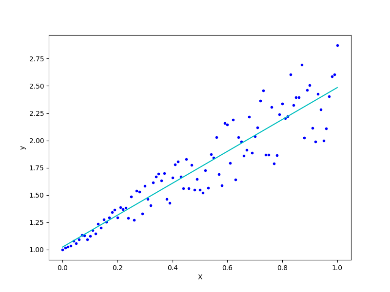
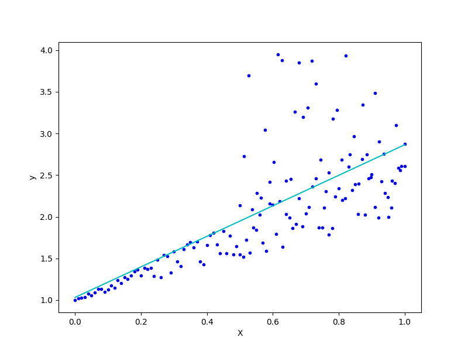
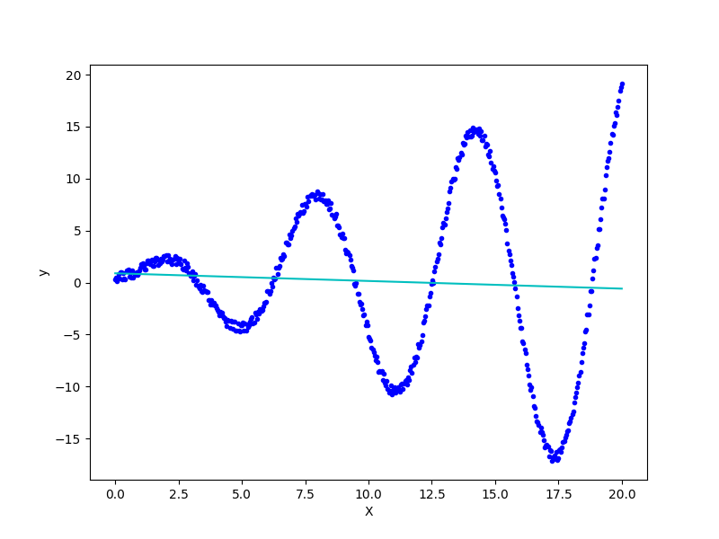

Oswaldo E. Hernández Hernández A01274570

# Linear Least Squared Errors #

## Result 1 ##

Why data2 does not behave as data1?

Because data2 has more outliers and sparser data.

Why does data3 not converge?

Because data3 is not linear, so the normal equation cannot obtain a good approximation
